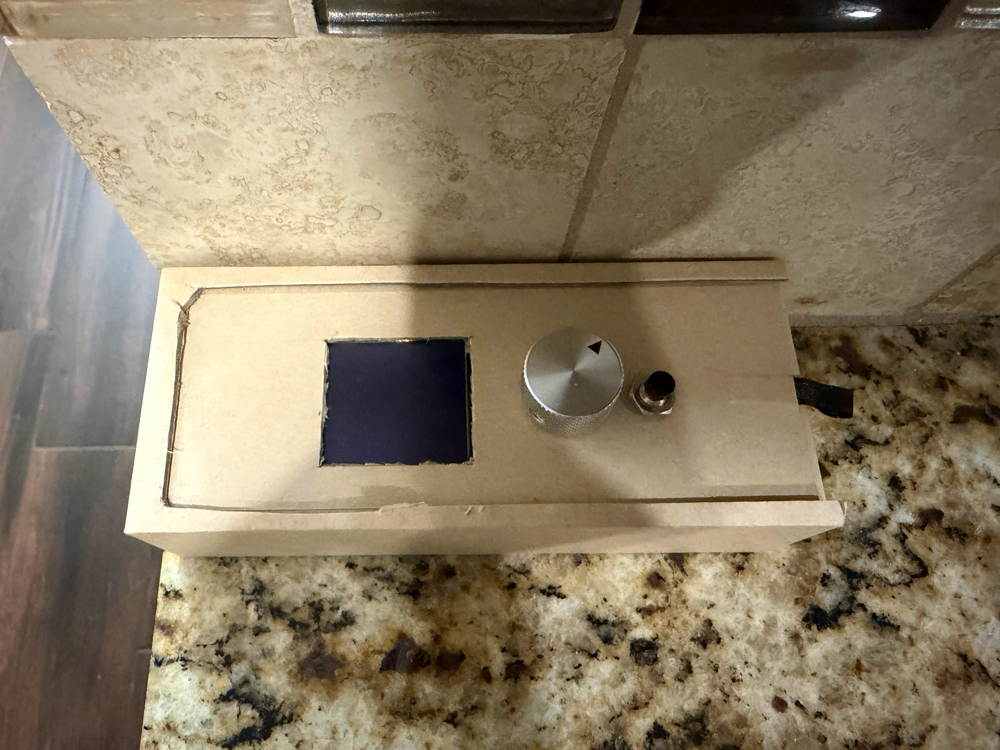
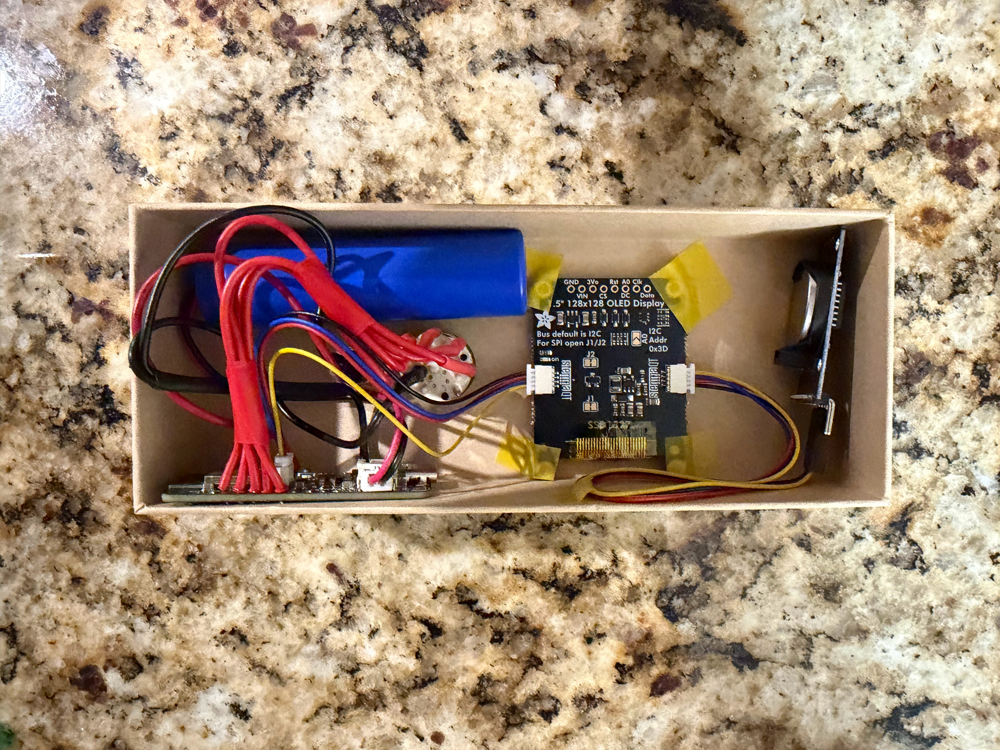
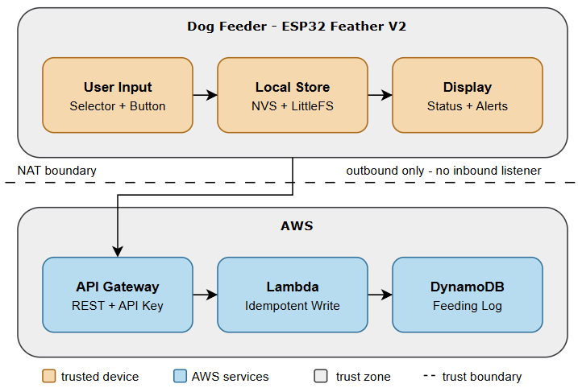
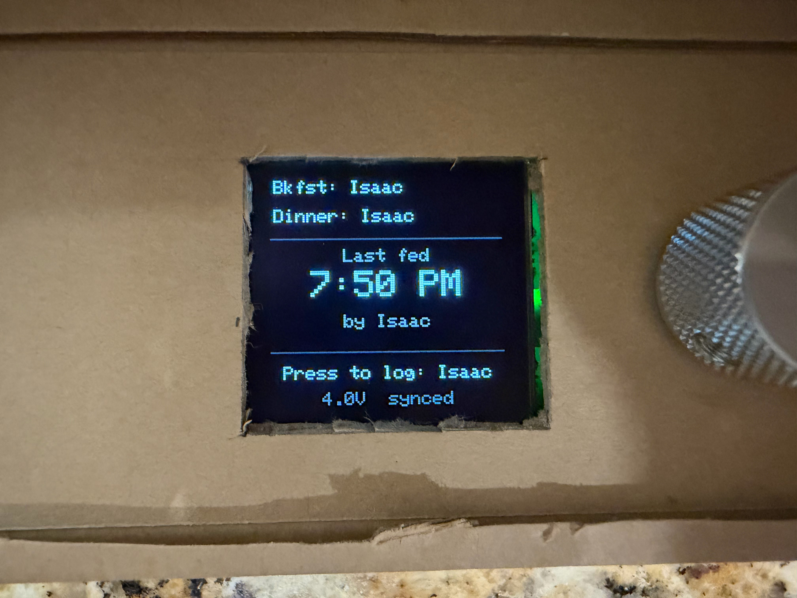
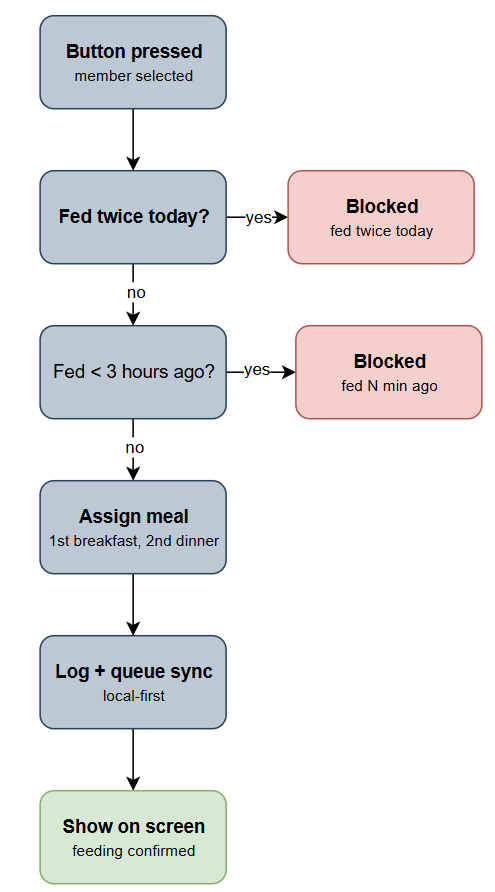
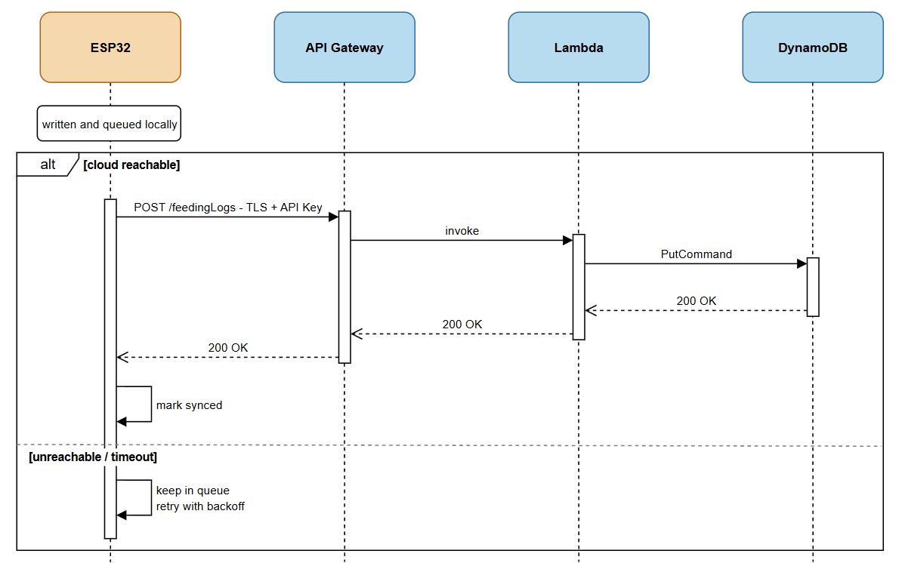

# Luna Feeder



ESP32 tracker that logs who fed the dog, when, and which meal, and blocks accidental double-feeds. Records live on the device; an AWS backend provides remote history and email notifications. Built alongside AWS Solutions Architect Associate study.

## Hardware



- Adafruit ESP32 Feather V2 (Arduino framework)
- DS3231 real-time clock
- OLED status display
- Local storage: LittleFS (feeding log), NVS (config and counters)

## Cloud stack

- API Gateway (REST, API key + usage plan) → Lambda → DynamoDB
- DynamoDB Streams → Lambda → SNS (email notifications)
- CloudWatch Logs
- Entire backend defined in one CloudFormation template, deployed by CodePipeline

## Architecture



The device is the source of truth; the cloud is a visibility layer. All feeding logic runs locally. If WiFi or AWS is unavailable, the feeder works unchanged and syncs pending records when connectivity returns.

The notification path is driven off the DynamoDB stream and is independent of ingest — a notification failure cannot affect recording.

## Feeding logic





On button press:

1. Block if already fed twice today.
2. Block if the last feeding was under three hours ago (overridable).
3. Meal is determined by order, not clock time: first feeding is breakfast, second is dinner.
4. Log locally, queue for sync, confirm on screen.

The recency window is tuned toward false warnings rather than missed double-feeds.

## Sync



Feedings are written locally first, then queued. The queue POSTs to AWS when reachable and retries with backoff when not. Each record carries a stable event ID and the cloud write is conditional on it, so retries cannot create duplicates.

## Notifications

One email per feeding, triggered by the table's stream:

```
🐕 Luna was fed dinner by Isaac at Tue, Aug 18, 6:02 PM CDT.
Battery: 3.82 V
```

- Timestamps are stored in UTC and rendered in Central Time at display (IANA zone, DST-safe).
- Battery alerts at 3.60 V (low) and 3.45 V (critical, tagged in the subject line). Li-ion voltage is nearly flat mid-discharge, so alerts fire on the curve's edges instead of estimating a percentage. Both thresholds are stack parameters, tunable without code changes.

## Infrastructure as code

- Single CloudFormation template (`cloud/infra/`) defines the table, both Lambdas, IAM roles, API Gateway with key and usage plan, SNS topic and subscription, and stream wiring. Deploys to any region or account unchanged; deleting the stack removes everything it created.
- CodePipeline (V2) deploys on merges to `main` that touch `cloud/infra/`, via a GitHub App connection. The pipeline uses a CloudFormation deploy role scoped to this stack's resources, and `main` is branch-protected. The console is read-only by convention; manual stack changes are reverted on the next deploy.
- The backend was originally hand-built in the console and converted to this template. The conversion surfaced two bugs, both fixed: a custom integration that mapped every response to HTTP 200 (replaced with proxy integration, so real status codes reach the device), and an unused OPTIONS method left over from the console's CORS setup (removed). Historical records were migrated with a disposable one-off stack that was deleted after the copy.

## Security

- The device sits behind home NAT and makes outbound connections only; the API endpoint is the sole exposed surface.
- The API key is rate limiting and blast-radius control, not authentication. The usage plan caps rate, burst, and daily quota.
- The API is one resource, one method (POST).
- WiFi and API credentials live in a gitignored `config.h`. The notification email is supplied as a pipeline parameter override, not committed.

Each Lambda has its own role. No managed policies; every grant is explicit:

| Role | Permission | Scope |
|---|---|---|
| Ingest Lambda | `dynamodb:PutItem` | feeding log table only |
| Ingest Lambda | write logs | own log group only (no `CreateLogGroup`) |
| Notifier Lambda | read stream | this table's stream only |
| Notifier Lambda | `sns:Publish` | one topic |
| Notifier Lambda | write logs | own log group only |

Neither function can read, scan, or delete table data. Boundaries are verified by testing that denied actions raise `AccessDeniedException`.

## Reliability

- Local-first writes; the sync queue drains after outages with backoff.
- RTC health check and NTP sync on boot.
- Idempotent cloud writes via conditional put on the event ID.
- The notifier logs and skips failed stream records rather than blocking the shard.

## Repository layout

```
cloud/
  infra/    CloudFormation template + parameter config
  lambda/   Lambda sources; the template's inline code mirrors these
firmware/   ESP32 source
docs/       images and diagrams
```