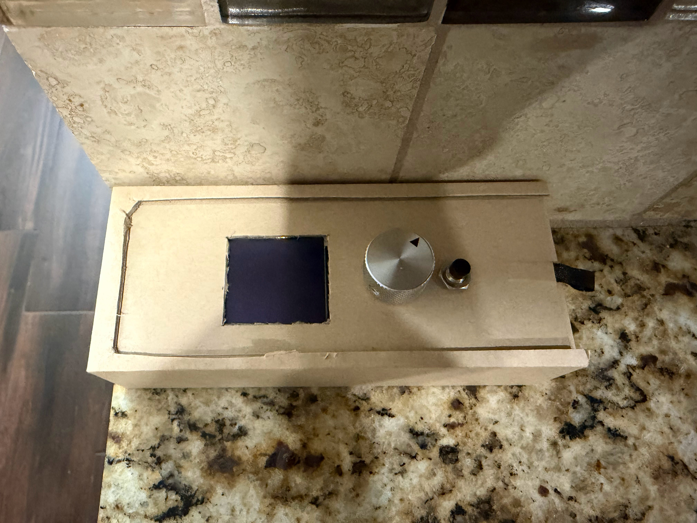
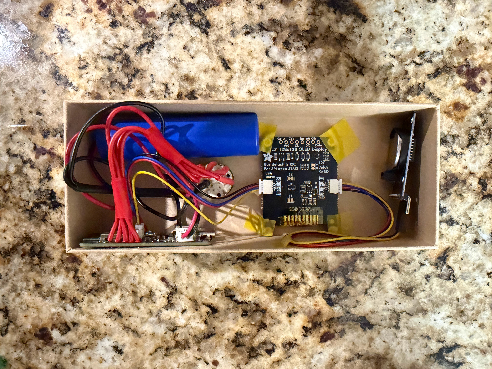
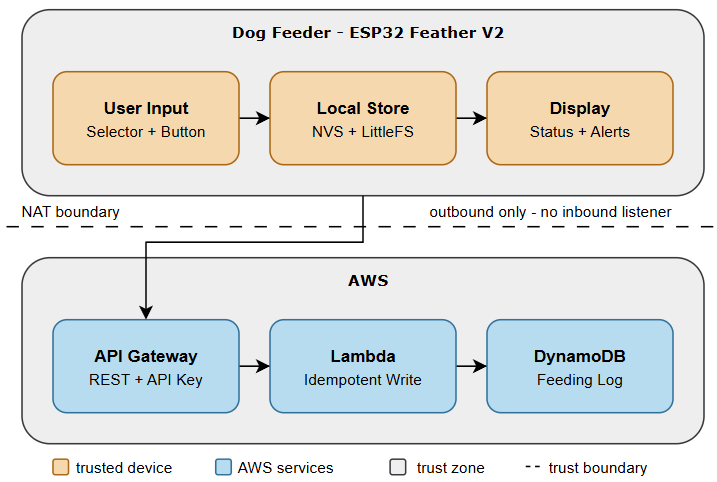
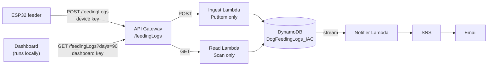
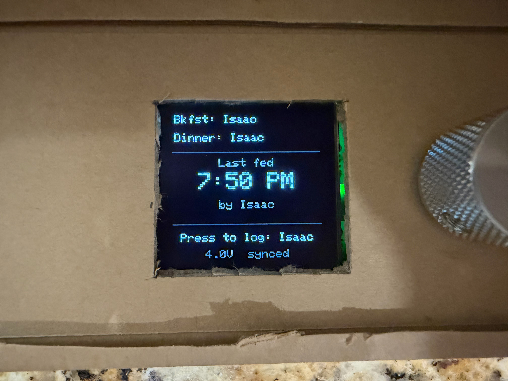
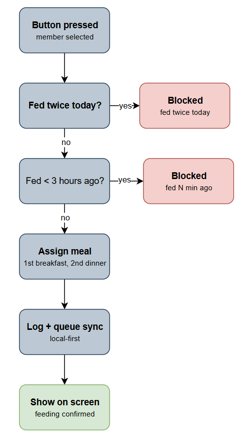
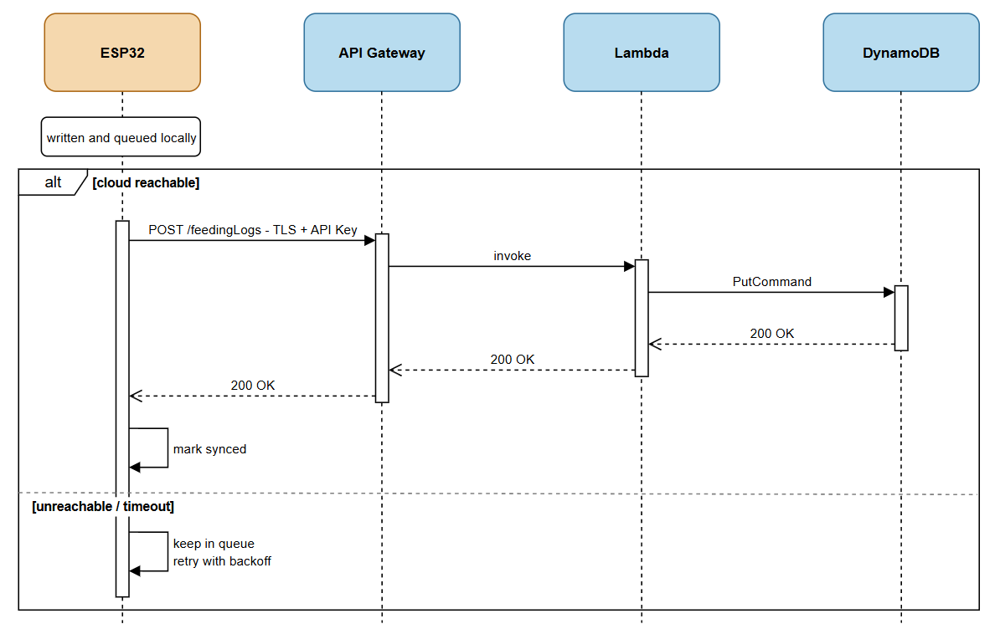
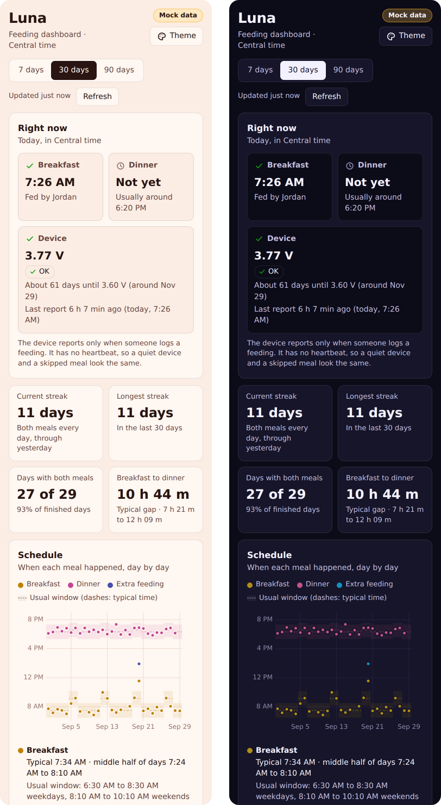

# Luna Feeder



ESP32 tracker that logs who fed the dog, when, and which meal, and blocks accidental double-feeds. Records live on the device; an AWS backend provides remote history, email notifications, and a read API behind an analytics [dashboard](#dashboard). Built alongside AWS Solutions Architect Associate study.

To deploy the backend in your own account, see [DEPLOYMENT.md](DEPLOYMENT.md).

## Hardware



- Adafruit ESP32 Feather V2 (Arduino framework)
- DS3231 real-time clock
- OLED status display
- Local storage: LittleFS (feeding log), NVS (config and counters)

## Cloud stack

- API Gateway (REST, API key + usage plan) → Lambda → DynamoDB
- DynamoDB Streams → Lambda → SNS (email notifications)
- API Gateway `GET` (its own key + usage plan) → read-only Lambda → DynamoDB, for the dashboard
- CloudWatch Logs
- Entire backend defined in one CloudFormation template, deployed by CodePipeline

## Architecture



The device is the source of truth; the cloud is a visibility layer. All feeding logic runs locally. If WiFi or AWS is unavailable, the feeder works unchanged and syncs pending records when connectivity returns.

The notification path is driven off the DynamoDB stream and is independent of ingest, a notification failure cannot affect recording.

The cloud side, including the read path added for the dashboard. Each Lambda has its own role, and each client its own API key:


```mermaid
flowchart LR
  device["ESP32 feeder"] -- "POST /feedingLogs<br/>device key" --> api["API Gateway<br/>/feedingLogs"]
  dash["Dashboard<br/>(runs locally)"] -- "GET /feedingLogs?days=90<br/>dashboard key" --> api
  api -- POST --> ingest["Ingest Lambda<br/>PutItem only"]
  api -- GET --> read["Read Lambda<br/>Scan only"]
  ingest --> table[("DynamoDB<br/>DogFeedingLogs_IAC")]
  read --> table
  table -- stream --> notifier["Notifier Lambda"]
  notifier --> sns["SNS"] --> email["Email"]
```

Reads never touch the write path: a read-side failure cannot affect recording or notifications.

## Feeding logic





On button press:

1. Block if already fed twice today.
2. Block if the last feeding was under three hours ago (overridable).
3. Meal is determined by order, not clock time: first feeding is breakfast, second is dinner.
4. Log locally, queue for sync, confirm on screen.

The recency window is tuned toward false warnings rather than missed double-feeds.

## Sync



Feedings are written locally first, then queued. The queue POSTs to AWS when reachable and retries on next wakeup when not. Each record carries a stable event ID and the cloud write is conditional on it, so retries cannot create duplicates.

## Notifications

One email per feeding, triggered by the table's stream:

```
🐕 Luna was fed dinner by Isaac at Tue, Aug 18, 6:02 PM CDT.
Battery: 3.82 V
```

- Timestamps are stored in UTC and rendered in Central Time at display (IANA zone, DST-safe).
- Battery alerts at 3.60 V (low) and 3.45 V (critical, tagged in the subject line). Li-ion voltage is nearly flat mid-discharge, so alerts fire on the curve's edges instead of estimating a percentage. Both thresholds are stack parameters, tunable without code changes.

## Read API

`GET /feedingLogs?days=7|30|90` (default 30) returns the feedings from the last N Central-time calendar days: today plus the days before it, starting at Central midnight, DST-safe.

```bash
curl -s "$INVOKE_URL?days=7" -H "x-api-key: $DASHBOARD_KEY"
```

```json
{
  "timezone": "America/Chicago",
  "days": 7,
  "from": "2026-09-23T05:00:00.000Z",
  "generatedAt": "2026-09-29T15:00:00.000Z",
  "count": 14,
  "unparseable": 0,
  "latest": { "...": "the most recent record, same shape as an item" },
  "items": [
    {
      "id": "feeder1-000210", "person": "Isaac", "meal": "dinner",
      "timestamp": "2026-09-29T00:12:08.114Z", "localDate": "2026-09-28", "localTime": "19:12",
      "override": false, "batteryVoltage": 3.73,
      "timeConfidence": "synced", "timeSource": "server-anchored"
    }
  ]
}
```

- Records come back raw and oldest first, plus `localDate` and `localTime` in Central time. Most dinners fall on the next UTC date, so grouping by the UTC date would pair each dinner with the next morning's breakfast.
- `latest` is the most recent record overall, even outside the window, so a silent device still shows when it last reported.
- Errors: `400` for any other `days`, `403` without the key, `429` over the dashboard usage plan, and `500` with a `requestId` to search for in `/aws/lambda/luna-feeder-read-iac`.

**Why a Scan.** The table's only key is `id`, a unique event ID, so a time range can't be expressed as a Query key condition; the Lambda Scans and filters. A Scan is billed for every item it reads, not what it returns: about 6 read units for the whole table today, whatever the range, which is fractions of a cent. The Lambda follows `LastEvaluatedKey`, so results stay complete past a Scan's 1 MB page (about five years at two records a day). A GSI keyed on time would make reads proportional to the range, but it would also change the ingest path, and at this volume that isn't worth it yet.

## Dashboard



A mobile-first page in `dashboard/` (vanilla JavaScript, [uPlot](https://github.com/leeoniya/uPlot) for the charts, Vite for development and builds). It reads the API once per load and computes everything in the browser. A 7 / 30 / 90-day selector drives every section.

- **Right now:** today's breakfast and dinner (who and when, or overdue), battery voltage and status, and the last report.
- **Streaks:** current and longest runs of days with both meals, the completion rate, and the typical breakfast-to-dinner gap.
- **Schedule:** each feeding's time of day, over bands showing the usual time, computed separately for weekdays and weekends.
- **Calendar:** each day split into a breakfast half and a dinner half, so a missed meal shows as a hole, plus a list of missed and off-schedule meals.
- **Who feeds Luna:** feedings per person, split by meal.
- **Battery:** voltage over time, with a projected date for the 3.60 V low threshold (a least-squares trend over the current charge's last 30 days).
- **Guard overrides:** each hold-to-override feeding and which guard it got past, re-derived with the firmware's rules.

Meals are placed by time of day rather than by the device's first-is-breakfast label, so a skipped breakfast doesn't turn dinner into "breakfast". All dates are Central time, whatever the viewer's timezone. Every chart has a table view. The default theme follows the device: Sunset by day, Moonlight by night, with Studio and Studio Dark also available. Each theme's meal colors are validated for color-blind separation.

Run it locally (Node 20.19+ or 22.12+):

```bash
cd dashboard
npm ci
cp .env.example .env.local   # gitignored
npm run dev                  # http://localhost:5173
```

It starts on **mock data**: 90+ days generated in the browser that follow the firmware's rules (meal labels, overrides, a lost clock, a deleted record, a battery recharge). Nothing is sent anywhere, and the mock code is stripped from production builds. For **live data**, set `VITE_DATA_SOURCE=live`, `VITE_API_URL` (the `InvokeUrl` output), and `VITE_API_KEY` (the dashboard key's value, see [DEPLOYMENT.md §7](DEPLOYMENT.md#7-retrieve-the-api-key-value)) in `.env.local`, then restart. To view it from a phone on the same Wi-Fi, run `npm run dev -- --host`, on trusted networks only.

Tests, internals, and themes: [dashboard/README.md](dashboard/README.md).

**It runs locally by design.** A browser has to send its API key, so a hosted page would hand the key to anyone who opens dev tools. API Gateway keys also aren't method-scoped, so the dashboard key could POST feedings too. Hosting would first need a real login; the plan for that is Cognito, with S3 and CloudFront for the site.

## Infrastructure as code

- Single CloudFormation template (`cloud/infra/`) defines the table, all three Lambdas, IAM roles, API Gateway (device and dashboard keys, each with its own usage plan, plus the CORS preflight and error responses), SNS topic and subscriptions, and stream wiring. Deploys to any region or account unchanged; deleting the stack removes everything it created.
- CodePipeline (V2) deploys on merges to `main` that touch `cloud/infra/`, via a GitHub App connection. The pipeline uses a CloudFormation deploy role scoped to this stack's resources, and `main` is branch-protected. The console is read-only by convention; manual stack changes are reverted on the next deploy.
- The deploy role's policy names each Lambda function and log group by ARN, so adding a Lambda means widening that policy before merging (the read Lambda did). A change set preview can't catch a missing grant: it runs as you, not as the deploy role.
- Only the backend deploys. `dashboard/` changes don't trigger the pipeline, and the dashboard runs locally (see [Dashboard](#dashboard)).
- Lambda code is inline in the template, with `cloud/lambda/` as the source of truth. For the read Lambda, `node --test cloud/lambda/test/readFeedingLogs.test.js` fails if the inline copy drifts from the source.
- The backend was originally hand-built in the console and converted to this template. The conversion surfaced two bugs, both fixed: a custom integration that mapped every response to HTTP 200 (replaced with proxy integration, so real status codes reach the device), and an unused OPTIONS method left over from the console's CORS setup (removed). An OPTIONS method has since returned, this time doing real work as the dashboard's CORS preflight. Historical records were migrated with a disposable one-off stack that was deleted after the copy.

## Security

- The device sits behind home NAT and makes outbound connections only; the API endpoint is the sole exposed surface.
- API keys are rate limiting and blast-radius control, not authentication. The device and the dashboard each have their own key and usage plan; the dashboard's is tighter (1 request/second, burst 5, 500 a day), so a leaked dashboard key can't do much or cost much.
- API Gateway keys aren't method-scoped: any key on the stage can call every key-required method. That is why the dashboard runs locally rather than hosted (see [Dashboard](#dashboard)).
- The API is one resource with three methods: POST (device), GET (dashboard), and an OPTIONS preflight that API Gateway answers itself, with no Lambda invoked.
- CORS allows any origin (the `CorsAllowOrigin` parameter, `*`) so the dashboard also works from a phone on the home network. CORS is enforced only by browsers, so it isn't what protects the API; the key is.
- WiFi and API credentials live in a gitignored `config.h`, and the dashboard's API URL and key in a gitignored `dashboard/.env.local`. The notification email is supplied as a pipeline parameter override, not committed.

Each Lambda has its own role. No managed policies; every grant is explicit:

| Role | Permission | Scope |
|---|---|---|
| Ingest Lambda | `dynamodb:PutItem` | feeding log table only |
| Ingest Lambda | write logs | own log group only (no `CreateLogGroup`) |
| Notifier Lambda | read stream | this table's stream only |
| Notifier Lambda | `sns:Publish` | one topic |
| Notifier Lambda | write logs | own log group only |
| Read Lambda | `dynamodb:Scan` | feeding log table only |
| Read Lambda | write logs | own log group only |

The ingest and notifier functions cannot read, scan, or delete table data; their boundaries are verified by testing that denied actions raise `AccessDeniedException`. The read function's role grants only `dynamodb:Scan`, so it cannot write, update, or delete; [DEPLOYMENT.md §9](DEPLOYMENT.md#9-verify-end-to-end) shows how to confirm that with the IAM policy simulator.

## Reliability

- Local-first writes; the sync queue drains after outages on next wakeup.
- RTC health check and NTP sync on boot.
- Idempotent cloud writes via conditional put on the event ID.
- The notifier logs and skips failed stream records rather than blocking the shard.

## Repository layout

```
cloud/
  infra/    CloudFormation template + parameter config
  lambda/   Lambda sources; the template's inline code mirrors these
    test/   read Lambda unit tests, including the template drift check
dashboard/  analytics dashboard, run locally (see dashboard/README.md)
firmware/   ESP32 source
docs/       images and diagrams
```